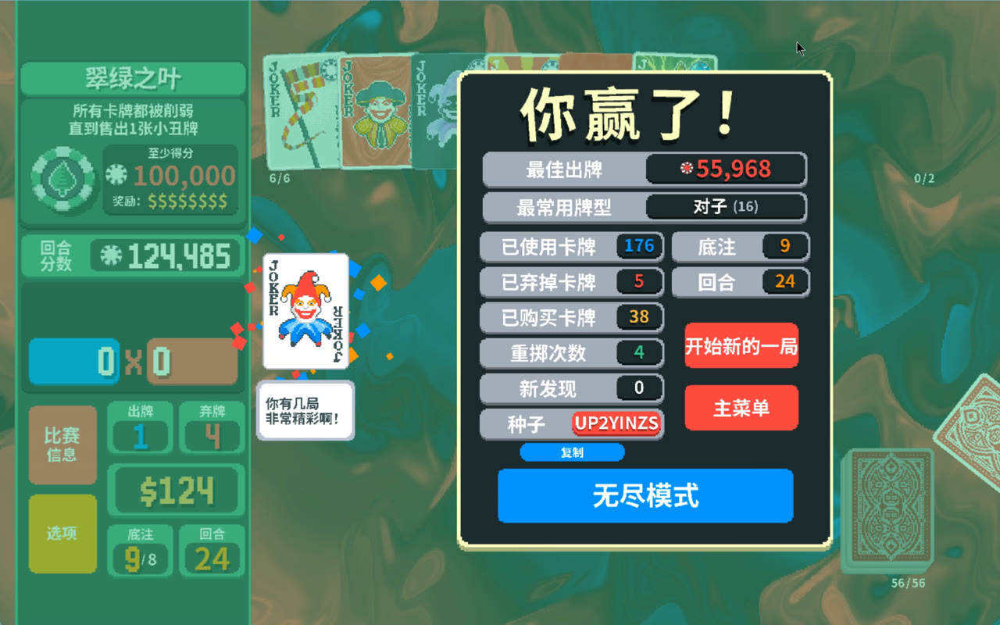
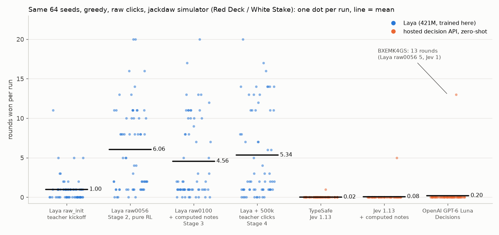
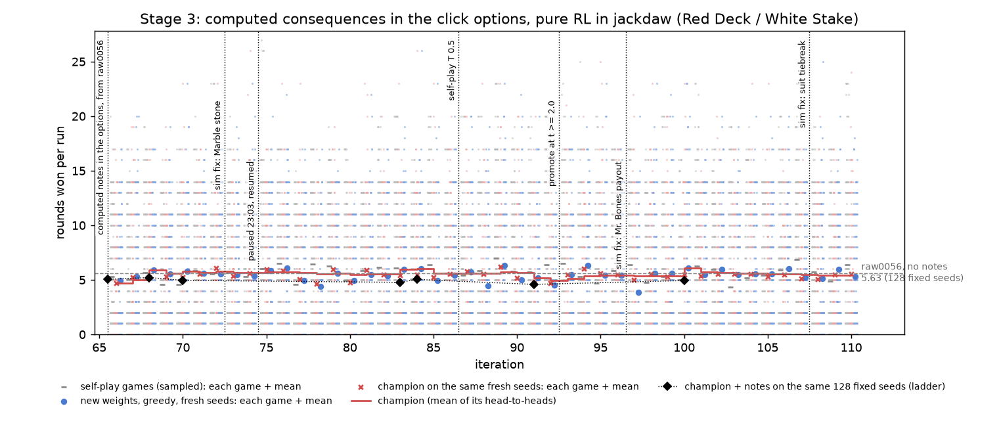

# Laya plays Balatro: results (v1.3)

## v1.3: a real win, recorded

raw0056 (best on the 128-seed ladder; Stage 2, no computed notes) played real Balatro greedily, every run screen-recorded. On random seeds: 9 runs, mean 4.89 rounds, best 14, no win; before this, 1 win in 541 raw-click real runs.

Then the simulator picked the seed. It now draws the real game's bosses (Steamodded indexes a hash-ordered pool; all 646 recorded real boss sequences match), so a seed Laya wins in jackdaw should win in the real game. 2,592 fresh random seeds, greedy: raw0056 won 3 (0.12%). Batched play on the GPU box can flip a near-tie, so each sim win was replayed alone on the validator PC (X0OVDA6S fell to 15 rounds there; UP2YINZS held, twice) before the real game played it.

**UP2YINZS: real Balatro 27 rounds, Ante 10, won; simulator twin 27 rounds.** The seed was chosen; the play was not: every click is Laya's, greedy, in the real game. Video: `media/laya_balatro_win_UP2YINZS.mp4` on Hugging Face.

Random-seed runs this session:

| rounds won | 0–2 | 3–5 | 6–8 | 9–11 | 12–14 | 15–17 | 18–23 | 24+ (win) |
|---|---|---|---|---|---|---|---|---|
| runs | 5 | 0 | 2 | 1 | 1 | 0 | 0 | 0 |

## Hosted decision APIs, zero-shot (v1.3)

OpenRouter's decisions endpoint (`POST /api/alpha/decisions`) takes a state string and a choice question and returns a probability per option, the same contract as Laya. Each API model played the same raw-click interface in the simulator (argmax of the returned probabilities, Red Deck / White Stake):

| player (first 64 ladder seeds) | mean rounds | median | best | wins | clicks | errors | API cost |
|---|---|---|---|---|---|---|---|
| Laya raw_init | 1.00 | 1.0 | 11 | 0 | – | – | – |
| Laya raw0056 | 6.06 | 5.0 | 20 | 0 | – | – | – |
| TypeSafe Jev 1.13 | 0.02 | 0.0 | 1 | 0 | 769 | 0 | $0.000 |
| Jev 1.13 + computed notes | 0.08 | 0.0 | 5 | 0 | 953 | 0 | $0.000 |
| OpenAI GPT-6 Luna Decisions | 0.20 | 0.0 | 13 | 0 | 1,195 | 0 | $0.045 |

The API models mostly lose in Ante 1: GPT-6 Luna Decisions skipped the very first blind in 34 of 62 traced games, and the models play single cards. It reached 13 rounds on one seed (BXEMK4GS). On that seed in real Balatro, whose boss draws differ from jackdaw's, it reached 5 rounds, Laya raw0056 11 and Jev 2 (side-by-side video `media/compare_BXEMK4GS.mp4`).

## Stage 4 (v1.3, aborted): imitate the teacher once more

From raw0056.pt without notes, imitation of the HF teacher's clicks (1,246,487 train clicks; 100 held-out games), in chunks of 100k clicks, with the 128-seed ladder after each chunk. Before: agreement 70.8%, ladder 5.63.

| chunk | teacher clicks | agreement (held out) | ladder (128 seeds) | median |
|---|---|---|---|---|
| 1 | 100,000 | 76.2% | 4.48 | 2.0 |
| 2 | 200,000 | 77.3% | 4.74 | 2.0 |
| 3 | 300,000 | 79.7% | 4.08 | 1.0 |
| 4 | 400,000 | 80.4% | 4.02 | 1.0 |
| 5 | 500,000 | 81.1% | 4.89 | 2.0 |

Closer imitation, worse play, as in Stage 1. Stopped after chunk 5.

## Stage 3 (v1.3): computed consequences in the click options

With `LAYA_CALC=1` each click option carries what it would do, computed and never advised: the exact score of the selected cards (jackdaw's own scoring on copies of the cards) and the odds of completing a flush or straight on the next draw. In real Balatro a lockstep simulator twin replays the run to compute the same notes. Training resumed from raw0056 (no new kickoff), pure RL as in Stage 2.

45 iterations (66–110), champion **raw0100.pt**.

Every champion on the same 128 fixed seeds, with notes (raw0056 without notes: 5.63):

| checkpoint | mean rounds | median |
|---|---|---|
| raw0056+calc | 5.05 | 2.0 |
| raw0068+calc | 5.21 | 3.5 |
| raw0070+calc | 4.95 | 2.5 |
| raw0083+calc | 4.77 | 2.0 |
| raw0084+calc | 5.04 | 2.0 |
| raw0091+calc | 4.59 | 2.0 |
| raw0100+calc | 4.94 | 2.0 |

Real Balatro with notes: 256 runs, mean 5.78 rounds, best 22; the twin computed notes for every move in 248/256 runs.

| checkpoint | runs | mean rounds | best | mean ante | wins | sim twin identical |
|---|---|---|---|---|---|---|
| raw0056.pt+calc | 22 | 5.45 | 17 | 2.4 | 0 | 21/22 |
| raw0068.pt+calc | 12 | 5.50 | 14 | 2.4 | 0 | 12/12 |
| raw0070.pt+calc | 69 | 6.39 | 22 | 2.7 | 0 | 68/69 |
| raw0083.pt+calc | 4 | 9.25 | 14 | 3.8 | 0 | 4/4 |
| raw0084.pt+calc | 44 | 5.30 | 14 | 2.4 | 0 | 43/44 |
| raw0091.pt+calc | 52 | 5.12 | 19 | 2.3 | 0 | 50/52 |
| raw0100.pt+calc | 53 | 5.98 | 17 | 2.5 | 0 | 52/53 |

No champion with notes beat raw0056 without them on the fixed seeds.

## Stage 2 (v1.1+): raw clicks, pure RL

Laya clicks like a player (`select K♥` ... `play selected`): one choice question per click, several clicks per decision, no pre-built combinations, hand labels or score estimates. The HF teacher is used once (kickoff imitation from sim0053); afterwards training is pure RL in the simulator on random seeds. Each iteration the new weights and the champion play the same fresh random seeds; a paired t >= 1 win takes the title. Real Balatro validates the champion on random seeds.

From iteration 48 (v1.2) a quarter of self-play hand turns are also searched in the simulator (`search.py`): every play scored exactly, candidate plays and discards rolled out on reshuffled decks, no draw order or RNG seen. The clicks toward the best moves become a soft target: the playing policy moved a step (0.3; 0.5 from iteration 59) toward them. Laya's interface is unchanged.

Kickoff (teacher clicks, held-out games): agreement 37.7% before -> **72.0%** after (hand 71.2%, shop 66.0%, pack 83.3%).

RL: 65 iterations, champion **raw0056.pt**.

| iter | train | new weights | champion | paired t | champion after |
|---|---|---|---|---|---|
| 51 | 6.61 | 5.44 | 5.67 | -0.7 | raw0050.pt |
| 52 | 6.21 | 5.69 | 5.74 | -0.2 | raw0050.pt |
| 53 | 4.94 | 5.58 | 5.83 | -0.8 | raw0050.pt |
| 54 | 6.46 | 6.21 | 5.83 | +0.9 | raw0050.pt |
| 55 | 6.34 | 5.92 | 5.59 | +0.8 | raw0050.pt |
| 56 | 5.93 | 6.62 | 5.92 | +2.0 | raw0056.pt |
| 57 | 5.86 | 5.16 | 4.99 | +0.7 | raw0056.pt |
| 58 | 6.57 | 5.58 | 5.60 | -0.1 | raw0056.pt |
| 59 | 7.09 | 6.09 | 6.20 | -0.4 | raw0056.pt |
| 60 | 5.46 | 6.52 | 6.43 | +0.3 | raw0056.pt |
| 61 | 6.06 | 5.43 | 5.23 | +0.8 | raw0056.pt |
| 62 | 5.79 | 6.27 | 6.02 | +0.7 | raw0056.pt |
| 63 | 5.07 | 5.68 | 5.57 | +0.4 | raw0056.pt |
| 64 | 7.01 | 6.43 | 6.19 | +0.8 | raw0056.pt |
| 65 | 5.48 | 5.66 | 5.63 | +0.1 | raw0056.pt |

Same 128 fresh seeds, greedy, every checkpoint (deal luck cancels):

| checkpoint | mean rounds | median | >= 9 rounds | wins |
|---|---|---|---|---|
| raw_init | 1.64 | 1.0 | 7/128 | 0 |
| raw0046 | 5.70 | 3.5 | 40/128 | 0 |
| raw0056 | 5.63 | 4.0 | 38/128 | 0 |

raw0056 vs raw0046: -0.07 rounds per seed (paired t -0.2).

Real Balatro validation:

| checkpoint | runs | mean rounds | best | mean ante | wins | sim twin identical |
|---|---|---|---|---|---|---|
| raw_init.pt | 4 | 0.25 | 1 | 1.0 | 0 | 4/4 |
| raw0002.pt | 12 | 5.33 | 12 | 2.5 | 0 | 11/12 |
| raw0007.pt | 3 | 9.00 | 11 | 3.3 | 0 | 3/3 |
| raw0008.pt | 7 | 4.14 | 16 | 2.0 | 0 | 6/7 |
| raw0010.pt | 37 | 6.76 | 17 | 2.9 | 0 | 34/37 |
| raw0021.pt | 51 | 5.33 | 20 | 2.4 | 0 | 50/51 |
| raw0032.pt | 1 | 26.00 | 26 | 9.0 | 1 | 1/1 |
| raw0033.pt | 1 | 5.00 | 5 | 2.0 | 0 | 1/1 |
| raw0034.pt | 6 | 4.83 | 14 | 2.2 | 0 | 6/6 |
| raw0035.pt | 24 | 7.29 | 15 | 3.0 | 0 | 22/24 |
| raw0041.pt | 15 | 4.80 | 11 | 2.2 | 0 | 14/15 |
| raw0044.pt | 6 | 8.17 | 14 | 3.2 | 0 | 5/6 |
| raw0046.pt | 20 | 5.65 | 19 | 2.5 | 0 | 18/20 |
| raw0050.pt | 38 | 5.50 | 14 | 2.4 | 0 | 38/38 |
| raw0056.pt | 60 | 4.93 | 17 | 2.2 | 0 | 59/60 |

## Stage 1 (v1.0): pre-built candidate moves

Champion **sim0053.pt**: simulator validation 9.01 rounds over 128 fixed seeds after 101 self-play iterations.

Real game: 81 runs on random seeds, mean 7.89 rounds won, best 17, mean max ante 3.1, 0 wins; simulator replay of the same seed matched in 73/81 runs.

Head-to-head checks (challenger beat the champion on the validation seeds, then both played 64 fresh seeds):

| iter | challenger | champion |
|---|---|---|
| 99 | 7.94 | 8.00 |
| 101 | 7.86 | 8.31 |

Imitation of the HF teacher (V68 heuristic, 74.6% win rate in Pylatro):

| chunk | decisions | agreement | sim val |
|---|---|---|---|
| 1 | 20000 | 80.2% | 8.95 |
| 2 | 40000 | 81.0% | 7.87 |
| 3 | 60000 | 82.8% | 7.95 |
| 4 | 80000 | 83.3% | 8.10 |
| 5 | 100000 | 83.9% | 8.34 |
| 6 | 120000 | 84.5% | 8.05 |
| 7 | 140000 | 84.3% | 7.97 |
| 8 | 160000 | 84.2% | 6.99 |
