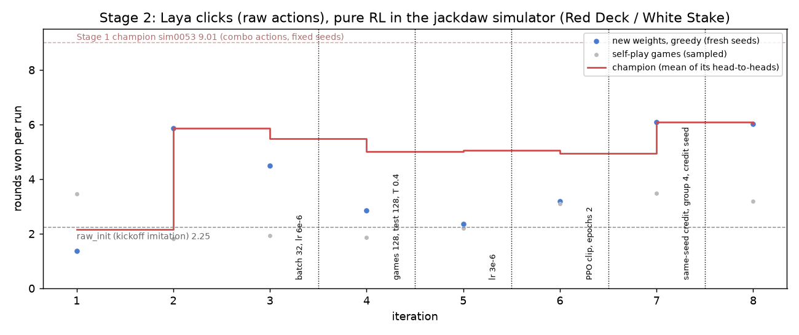
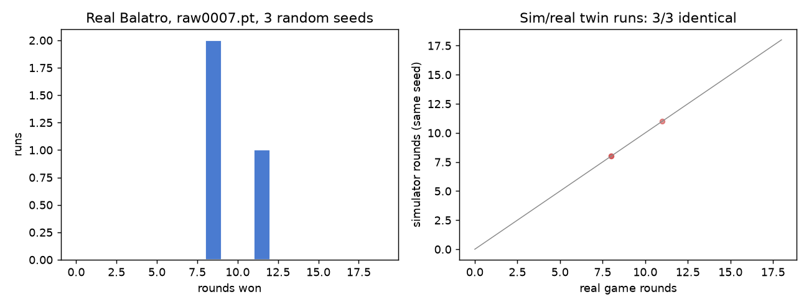
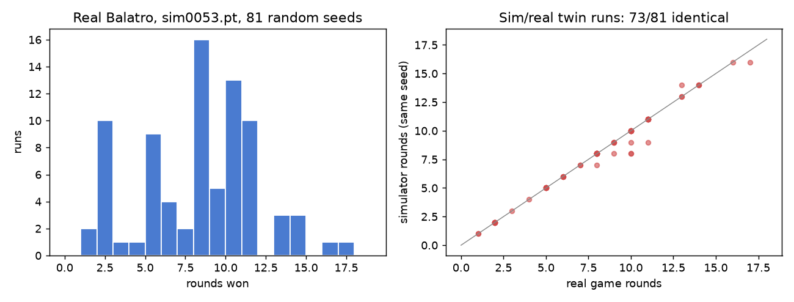
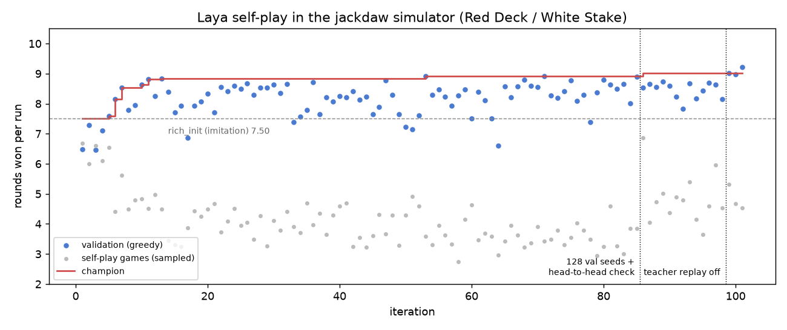
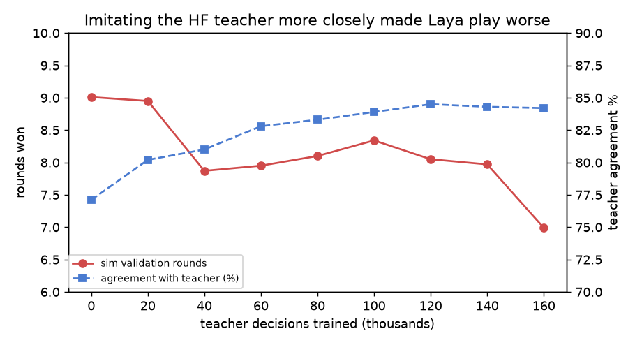

# Laya plays Balatro: results (v1.1)

## Stage 2 (v1.1+): raw clicks, pure RL

Laya clicks like a player (`select K♥` ... `play selected`): one choice question per click, several clicks per decision, no pre-built combinations, hand labels or score estimates. The HF teacher is used once (kickoff imitation from sim0053); afterwards training is pure RL in the simulator on random seeds. Each iteration the new weights and the champion play the same fresh random seeds; a paired t >= 1 win takes the title. Real Balatro validates the champion on random seeds.

Kickoff (teacher clicks, held-out games): agreement 37.7% before -> **72.0%** after (hand 71.2%, shop 66.0%, pack 83.3%).

RL: 8 iterations, champion **raw0008.pt**.

| iter | train | new weights | champion | paired t | champion after |
|---|---|---|---|---|---|
| 1 | 3.47 | 1.38 | 2.16 | -1.7 | raw_init.pt |
| 2 | 1.83 | 5.88 | 2.34 | +5.3 | raw0002.pt |
| 3 | 1.92 | 4.50 | 5.09 | -1.1 | raw0002.pt |
| 4 | 1.86 | 2.86 | 4.09 | -2.2 | raw0002.pt |
| 5 | 2.20 | 2.36 | 5.20 | -6.8 | raw0002.pt |
| 6 | 3.10 | 3.19 | 4.49 | -3.4 | raw0002.pt |
| 7 | 3.48 | 6.09 | 5.16 | +2.8 | raw0007.pt |
| 8 | 3.20 | 6.02 | 5.20 | +2.5 | raw0008.pt |

Real Balatro validation:

| checkpoint | runs | mean rounds | best | mean ante | wins | sim twin identical |
|---|---|---|---|---|---|---|
| raw_init.pt | 4 | 0.25 | 1 | 1.0 | 0 | 4/4 |
| raw0002.pt | 12 | 5.33 | 12 | 2.5 | 0 | 11/12 |
| raw0007.pt | 3 | 9.00 | 11 | 3.3 | 0 | 3/3 |

## Stage 1 (v1.0): pre-built candidate moves

Champion **sim0053.pt**: simulator validation 9.01 rounds over 128 fixed seeds after 101 self-play iterations.

Real game: 81 runs on random seeds, mean 7.89 rounds won, best 17, mean max ante 3.1, 0 wins; simulator replay of the same seed matched in 73/81 runs.

Head-to-head checks (challenger beat the champion on the validation seeds, then both played 64 fresh seeds):

| iter | challenger | champion |
|---|---|---|
| 99 | 7.94 | 8.00 |
| 101 | 7.86 | 8.31 |

Imitation of the HF teacher (V68 heuristic, 74.6% win rate in Pylatro):

| chunk | decisions | agreement | sim val |
|---|---|---|---|
| 1 | 20000 | 80.2% | 8.95 |
| 2 | 40000 | 81.0% | 7.87 |
| 3 | 60000 | 82.8% | 7.95 |
| 4 | 80000 | 83.3% | 8.10 |
| 5 | 100000 | 83.9% | 8.34 |
| 6 | 120000 | 84.5% | 8.05 |
| 7 | 140000 | 84.3% | 7.97 |
| 8 | 160000 | 84.2% | 6.99 |
